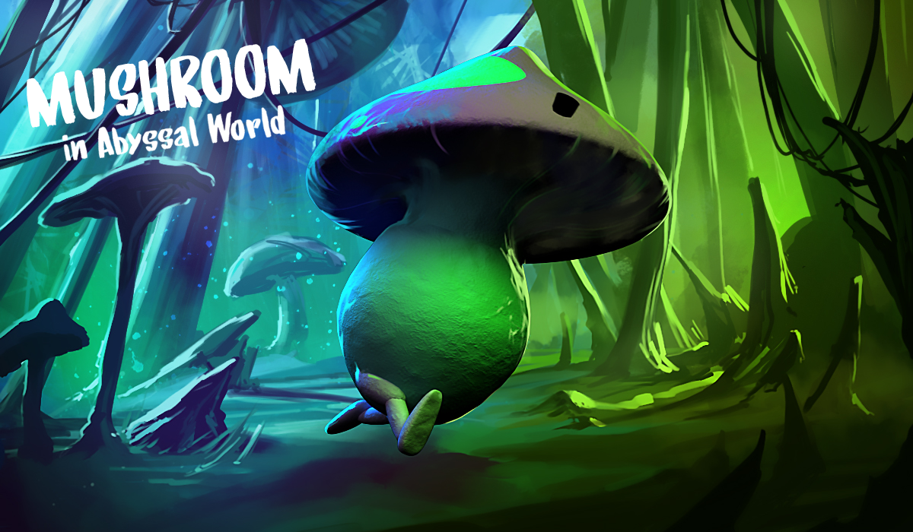

	

# Mushroom in abyssal world

Jeu réalisé en moins de 48h lors du concours de création de jeux [Hitbox Makers 2018](https://hitboxmakers.fr/)

## Lancement local

1. Téléchargez une [release](https://github.com/Leoche/HitboxGameJam2018/releases) en cliquant sur le bouton `zip` et l'extraire
2. Lancez `server_windows.exe` ou `server_linux` selon si votre OS est Windows ou Linux
3. Accedez à http://127.168.0.1:8080/index.html

## Jouer en ligne

// To do

## Créateurs

#### Graphistes

- Masquilier Rémy
- Lemoine Adrien
- Hetroy Marion

#### Développeurs

- Desigaux Léo - [@Leoche](https://github.com/Leoche)
- Moulard Paul - [@esunea](https://github.com/esunea)

## Changement version 1.0.0

###### Notes pour Tiled

Enfait le soucis qu'on avait quand on voulait éditer des niveaux et que ça plantais, c'est qu'on éditait pas le niveau directement dans les fichiers du jeu mais en se les envoyant par slack etc. Alors que maintenant juste en téléchargeant les sources du jeu et en ouvrant les levels sur Tiled dans /assets/levels y'a plus aucun soucis un simple CTRL+S suffit.

###### Nouveaux Niveaux

- ALIVE_0 : Tutoriel  **(nouveau)**
- ALIVE_1 : Premier niveau de la jam
- ALIVE_2 : Niveau à faire
- DEAD_0 : Deuxième niveau de la jam
- DEAD_1 : Niveau à faire
- DEAD_2 : Niveau à faire

###### Résolutions de bugs

- Les animations du persos ne sont plus buggés (même si tout n'est pas utilisé)
- Les champis peuvent à nouveau avoir un `sens` égal à `up` les bug de collisions pour les champis qui montent sont réglés
- On ne peux plus aller dans le décors quand on reste appuyé sur R/restart (la vélocité en Y est reset)
- On ne peux plus rester appuyer sur saut et sauter en mode wtf

###### Ronces

- Ajout des ronces (yea!), elles évoluent en 6 états: l'état 0 et 1 ne sont pas mortels alors que 2, 3, 4, 5 le sont, leur hitbox est évolutive et assez permissives

- Les ronces en état 0 et 1 ne sont plus violettes mais verte puis bleu pour indiquer l'état non mortel

###### Tiled

- La balise **end** a maintenant une propriété `next ` qui doit contenir le nom du niveau suivant sans le .json (ex: `DEAD_2`) ou alors `credits` si c'est le dernier niveau
- Les balises **ronces** ont maintenant une propriété `start` qui définit l'état ou la ronce commence (eg: l'état 0 et 1 ne sont pas mortels alors que 2, 3, 4, 5 le sont)
- Les balises **ronces** ont maintenant une propriété `sens` qui vaut soit `up` soit `down` qui défini si la ronce est sur le sol (up) ou sur un plafond (down)

###### Textures

- Ajout de la deuxième partie de la porte dans terrain.png
- Ajout et modifications des panneaux "tuto"
- Modifications des bouttons qui n'étaits pas bien croppés (la surbrillance qui dépasse des dimensions de l'image)

---

	
	

