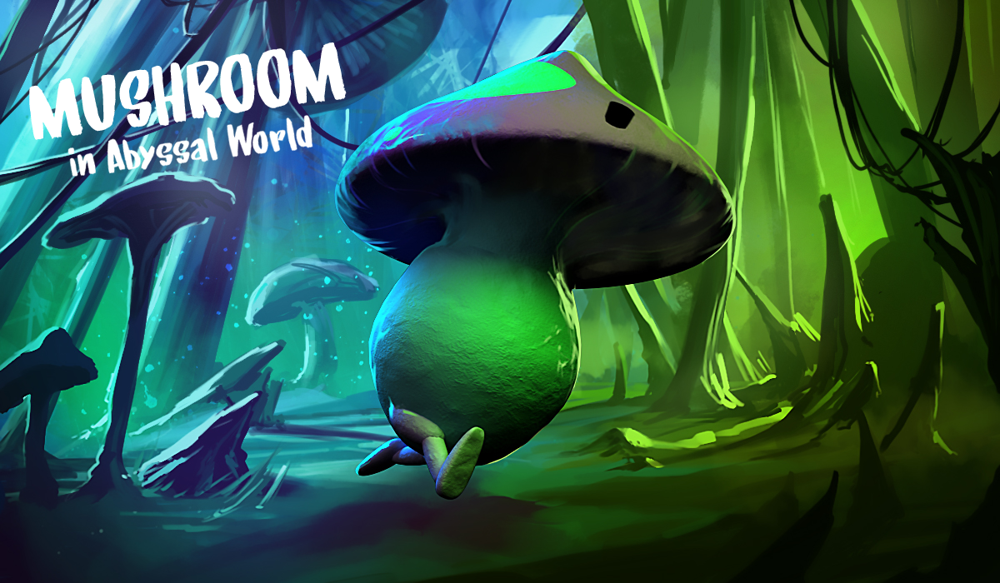

	

# Mushroom in abyssal world

Jeu réalisé en moins de 48h lors du concours de création de jeux [Hitbox Makers 2018](https://hitboxmakers.fr/) 

## Lancement local

1. Téléchargez une [release](https://github.com/Leoche/HitboxGameJam2018/releases) en cliquant sur le bouton `zip` et l'extraire
2. Lancez `server_windows.exe` ou `server_linux` selon si votre OS est Windows ou Linux
3. Accedez à http://127.168.0.1:8080/index.html ou [Cliquez ici](http://127.168.0.1:8080/index.html)

## Jouer en ligne

// To do

## Créateurs

#### Graphistes

- Masquilier Rémy
- Lemoine Adrien
- Hetroy Marion

#### Développeurs

- Desigaux Léo
- Moulard Paul

	
	

